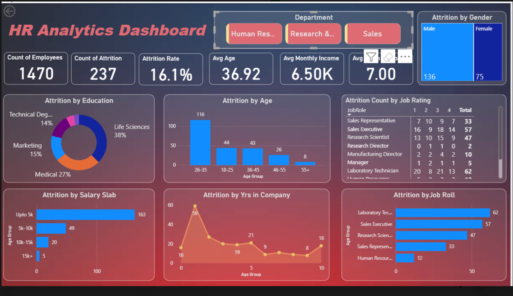

# 🧠 HR Analytics Dashboard (Power BI + Excel)

## 📊 Project Overview
The **HR Analytics Dashboard** is a data visualization project created using **Power BI** and **Excel** to analyze employee data and uncover insights that can help HR teams improve employee retention and performance.

This project focuses on exploring employee **attrition, salary distribution, demographics, and work experience** — helping management make data-driven decisions.

---

## 🎯 Objectives
- Understand patterns and trends behind **employee attrition**.
- Analyze data by **department, job role, age, gender, and salary**.
- Identify which factors are influencing employees to leave.
- Present findings through an **interactive Power BI dashboard**.

---

## 🧩 Dataset Details
The dataset was cleaned in **Excel** and visualized in **Power BI**.  
It includes:
- Employee ID  
- Age  
- Gender  
- Department  
- Education Field  
- Job Role  
- Marital Status  
- Monthly Income  
- Years at Company  
- Performance Rating  
- Attrition (Yes/No)

---

## ⚙️ Tools Used
- **Microsoft Excel** → Data Cleaning, Removing Duplicates, Handling Missing Values  
- **Power BI** → Data Visualization, Dashboard Creation, Insight Presentation  

---

## 📈 Key Insights
1. **Attrition Rate:** About 16% of total employees left the company.  
2. **By Department:** Highest attrition in *Sales* and *Research & Development*.  
3. **By Age Group:** Younger employees (26–35) are more likely to leave.  
4. **By Salary:** Lower salary bands have significantly higher attrition.  
5. **By Gender:** Male employees show slightly higher turnover.  
6. **By Experience:** Employees with 1–5 years of service are leaving more.  
7. **Performance:** Attrition not strongly linked to performance — even good performers are leaving.  

---

## 💡 Recommendations
- Review **salary structure** for lower-paid employees.  
- Offer **career growth opportunities** and internal training programs.  
- Improve **employee engagement and satisfaction** through surveys.  
- Implement **flexible work policies** for better retention.  

---

## 🧠 Skills Demonstrated
- Data Cleaning & Preparation in Excel  
- Data Visualization using Power BI  
- Analytical Thinking & Insight Generation  
- Dashboard Design & Storytelling with Data  

---

## 📂 Project Files
| File Name | Description |
|------------|-------------|
| `HR_Dataset.xlsx` | Cleaned dataset used for dashboard |
| `HR_Analytics_Dashboard.pbix` | Power BI Dashboard file |
| `README.md` | Project documentation (this file) |
| `Dashboard_Screenshot.png` | Image preview of the dashboard |

---

## Project image

## 🏁 Conclusion
This HR Analytics project highlights how **Power BI and Excel** can be used together to convert raw HR data into meaningful insights.  
It demonstrates practical data analysis and visualization skills required for real-world HR decision-making.

---

